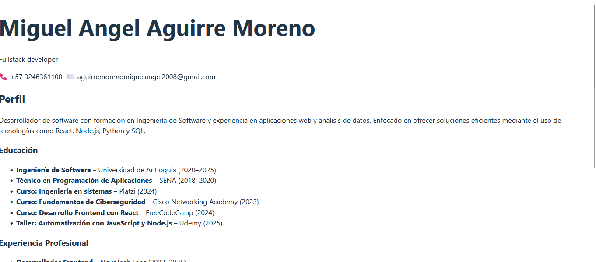

# React + Vite

# CV React - Miguel Aguirre

Este proyecto es una hoja de vida (CV) completamente modular desarrollada en **React** con **Vite**. Está estructurada por componentes funcionales anidados, cada uno representando una sección específica del currículum: Cabecera, Perfil, Experiencia y Educación.

## 📸 Vista previa



> Asegúrate de haber colocado tu captura en `./assets/screenshot.png`. Puedes cambiar esta ruta si usas otra ubicación.

## 🚀 Tecnologías usadas

- React
- Vite
- JavaScript
- HTML/CSS
- Git & GitHub

## 🧩 Estructura de componentes

- `CabeceraCV`: nombre, título profesional y datos de contacto.
- `Perfil`: descripción personal y habilidades.
- `Experiencia`: lista de experiencias laborales o proyectos.
- `Educacion`: formación académica y cursos complementarios.

## 🔧 Cómo ejecutar el proyecto

```bash
# 1. Clona el repositorio
git clone https://github.com/miguelucho425526/cv-react

# 2. Entra al directorio del proyecto
cd cv-react

# 3. Instala las dependencias
npm install

# 4. Ejecuta el servidor de desarrollo
npm run dev
